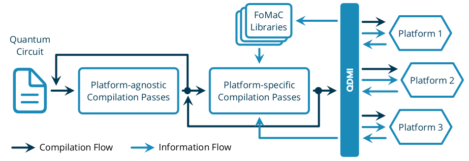

<!--
  Part of the MQSS Project, under the Apache License v2.0 with LLVM Exceptions.
  See https://llvm.org/LICENSE.txt for license information.
  SPDX-License-Identifier: Apache-2.0 WITH LLVM-exception
-->

> [!IMPORTANT]
>
> The Quantum Device Management Interface (QDMI) is experimental at this stage, and significant
> changes, including breaking changes, are anticipated in upcoming releases.

# QDMI — Quantum Device Management Interface (QDMI)

<!-- [DOXYGEN MAIN] -->

The Quantum Device Management Interface (QDMI) is the central part of the Munich Quantum Software
Stack (MQSS)—a sophisticated software stack to connect end users to the wide range of possible
quantum backends. It enables the submission to and the control of gate-based quantum systems and
enables software tools to automatically retrieve and adapt to changing physical characteristics and
constraints of different platforms. QDMI strives to connect the software and hardware developers,
mediating between their competing interests, bridging between technologies, and eventually providing
corresponding figures of merits and constraints to be considered. QDMI is therefore the method of
choice for integrating new platforms into the MQSS and for software tools to query information from
these platforms. QDMI is provided as a C header file to allow fast integration into an HPC
environment and consists of three main components:

- **QDMI Core**: Provides core functionality to manage sessions as well as to open and close
  connections to devices.
- **QDMI Query**: Allows querying properties of the device, e.g., supported gates, error rates, gate
  duration, etc.
- **QDMI Control**: Enables the control of the quantum devices. One can submit quantum circuits,
  control the job queue, and readout measurement results.

<!-- [DOXYGEN MAIN] -->

  

> [!IMPORTANT]
>
> The Quantum Device Management Interface (QDMI) is in an active development phase. Our development
> process is open to the community, encouraging contributions and feedback. Please be aware that
> QDMI is experimental at this stage, and significant changes, including breaking changes, are
> anticipated in upcoming releases. We value your input and invite you to participate in shaping
> QDMI's future. For the latest updates and to contribute, visit our
> [issues page](https://github.com/Munich-Quantum-Software-Stack/QDMI/issues).

## FAQ

<!-- [DOXYGEN FAQ] -->

### What is MQSS?

**MQSS** stands for _Munich Quantum Software Stack_, which is a project of the _Munich Quantum
Valley (MQV)_ initiative and is jointly developed by the _Leibniz Supercomputing Centre (LRZ)_ and
the Chairs for _Design Automation (CDA)_, and for _Computer Architecture and Parallel Systems
(CAPS)_ at TUM. It provides a comprehensive compilation and runtime infrastructure for on-premise
and remote quantum devices, support for modern compilation and optimization techniques, and enables
both current and future high-level abstractions for quantum programming. This stack is designed to
be capable of deployment in a variety of scenarios via flexible configuration options, including
stand-alone scenarios for individual systems, cloud access to a variety of backends as well as tight
integration into HPC environments supporting quantum acceleration. Within the MQV, a concrete
instance of the MQSS is deployed at the LRZ for the MQV, serving as a single access point to all of
its quantum devices via multiple compatible access paths, including a web portal, command line
access via web credentials as well as the option for hybrid access with tight integration with LRZ's
HPC systems. It facilitates the connection between end-users and quantum computing platforms by its
integration within HPC infrastructures, such as those found at the LRZ.

### What is QDMI?

**QDMI**, or _Quantum Device Management Interface_, serves as the communication interface between
software within the MQSS and the quantum hardware connected to the MQSS. The aim is to provide a
standard way to communicate with quantum resources that can be widely used by the whole quantum
community.

### Who is using QDMI?

QDMI will be the default communication channel within the MQSS, meaning all hardware and software
tools integrated into the MQSS will have to support QDMI. Moreover, platforms implementing QDMI can
also be seamlessly integrated in other software stacks understanding QDMI, as can software tools
interfacing with QDMI for platform feedback.

### Where is the code?

The code is publicly available hosted on GitHub at
[github.com/Munich-Quantum-Software-Stack/QDMI](https://github.com/Munich-Quantum-Software-Stack/QDMI).

### Under which license is QDMI released?

QDMI is released under the Apache License v2.0 with LLVM Exceptions. See
[LICENSE](https://github.com/Munich-Quantum-Software-Stack/QDMI/blob/develop/LICENSE) for more
information. Any contribution to the project is assumed to be under the same license.

### Why is it written in C and not in Python?

The interface is written in C to allow close integration within the MQSS and fulfill the performance
as well as stability requirements needed for production systems, in particular as we scale quantum
systems. Further, this enables a clean integration into existing and well-established system
software stacks, including those for HPC.

### Can I still integrate my Python code?

Python natively allows calling C APIs. So while it might not be as straightforward as the usage from
C/C++, it is definitely possible. However, we generally do expect Python-based programming
approaches to be used as front-ends, feeding into a natively implemented compiler infrastructure,
which then relies on QDMI. This is very analog on how Python is used in many other parts of
high-performance computing.

<!-- [DOXYGEN FAQ] -->

## Contact

The development of this project is led by [Laura Schulz](mailto:laura.schulz@lrz.de) (LRZ),
[Martin Schulz](mailto:martin.w.j.schulz@tum.de) (TUM CAPS), and
[Robert Wille](mailto:robert.wille@tum.de) (TUM CDA) on the management side and
[Lukas Burgholzer](mailto:lukas.burgholzer@tum.de) (TUM CDA) as well as
[Jorge Echavarria](mailto:jorge.echavarria@lrz.de) (LRZ) from the technical side.

Please try to use the publicly accessible GitHub channels
([issues](https://github.com/Munich-Quantum-Software-Stack/QDMI/issues),
[discussions](https://github.com/Munich-Quantum-Software-Stack/QDMI/discussions),
[pull requests](https://github.com/Munich-Quantum-Software-Stack/QDMI/pulls)) to allow for a
transparent and open discussion as much as possible.
