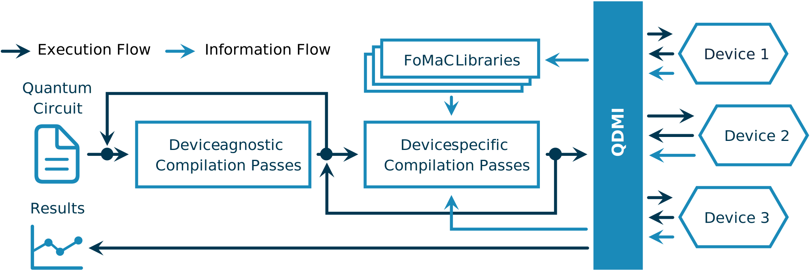

# QDMI {#mainpage}

## Quantum Device Management Interface



The Quantum Device Management Interface (QDMI) is the central part of the Munich Quantum Software
Stack (MQSS)—a sophisticated software stack to connect end users to the wide range of possible
quantum backends. It enables the submission to and the control of gate-based quantum systems and
enables software tools to automatically retrieve and adapt to changing physical characteristics and
constraints of different platforms. QDMI strives to connect the software and hardware developers,
mediating between their competing interests, bridging between technologies, and eventually providing
corresponding figures of merits and constraints to be considered. QDMI is therefore the method of
choice for integrating new platforms into the MQSS and for software tools to query information from
these platforms. QDMI is provided as a C header file to allow fast integration into an HPC
environment and consists of four main components:

- **QDMI Core**: Provides core functionality to manage sessions as well as to open and close
  connections to devices.
- **QDMI Control**: Enables the control of the quantum devices. One can submit quantum circuits,
  control the job queue, and readout measurement results.
- **QDMI Device**: Provides device handling functionality, like initiating the calibration or
  checking the status of the device.
- **QDMI Query**: Allows querying properties of the device, e.g., supported gates, error rates, gate
  duration, etc.

---

```{toctree}
:caption: User Guide

faq
support
```

```{toctree}
:caption: API Reference

api/index
```
